# 控件预览

全部截图由 `cargo run --example gallery` 用 Aegle 的软件渲染器无窗口生成，2 倍缩放，种子色为 Material 基准紫 `#6750A4`。每张图上行为浅色主题、下行为深色主题。颜色与弹簧动画稳定后截取；“按下”状态在涟漪展开后截取。

## 按钮

五种颜色样式：elevated、filled、tonal、outlined、text；可带前置图标。

状态：悬停与焦点是 8% / 10% 的状态层，按下是从按下点展开的涟漪，焦点环为 secondary 色 3 dp、外扩 2 dp，只在键盘焦点时显示；禁用为 onSurface 12% 容器与 38% 内容。

五种尺寸：XS 32、S 40（默认）、M 56、L 96、XL 136 dp，分别使用 label large、title medium、headline small、headline large 字体角色。

切换按钮：未选中为圆形，选中变为方形（square 形状则相反）；按下时角半径以 expressive 快速空间弹簧收缩到按下形状。

## 图标按钮

四种样式（standard、filled、tonal、outlined）、五种尺寸、三种宽度（narrow、default、wide），可作切换按钮。

## 悬浮操作按钮（FAB）

FAB 56、medium 80、large 96 dp，六种配色（三种 container 与三种强调色），elevation 3、悬停 4。扩展 FAB 在图标旁显示标签，`set_extended(false)` 收起为图标。

FAB 菜单：打开时 FAB 变为该配色组强调色的圆形关闭按钮，菜单项（56 dp 胶囊、对应 container 色）自下而上依次以快速空间弹簧升起并淡入；点选菜单项后关闭。

## 按钮组

标准按钮组按尺寸留出 18/12/8/8/8 dp 间距；按下某个按钮时它向两侧邻居伸展 15%，邻居相应让出，松开后以弹簧回弹（只改变绘制，不重新布局）。连接按钮组间距 2 dp，内侧角为 4/8/8/16/20 dp，按下时更方，选中时整体变圆；可设为单选（恰好一个选中）或多选。

## 分割按钮

动作按钮与菜单按钮相距 2 dp，内侧角 4/4/4/8/12 dp，悬停、焦点和按下时变圆（12 dp 等）；菜单打开时菜单部分变为圆形、箭头翻转。颜色不随打开改变，只加状态层。

## 分段按钮

经典 M3 分段按钮：40 dp 高、外侧全圆、内侧直角、相邻分段共用 1 dp 轮廓；选中分段填充 secondary container 并显示对勾。支持单选与多选。

## 复选框

18 dp 方框、2 dp 轮廓；选中时填充 primary 并沿路径画出对勾（不确定状态为横线），错误状态为 error 色。悬停、焦点、按下为 40 dp 圆形状态层；可带标签。

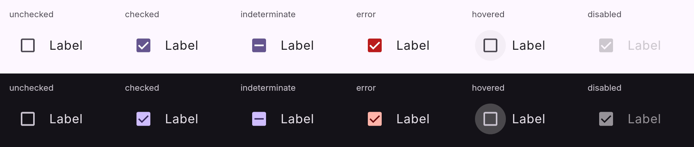

## 单选按钮

20 dp 圆环，选中时 10 dp 圆点以弹簧放大；同一父容器内的单选按钮互斥，方向键在其间移动并选择。

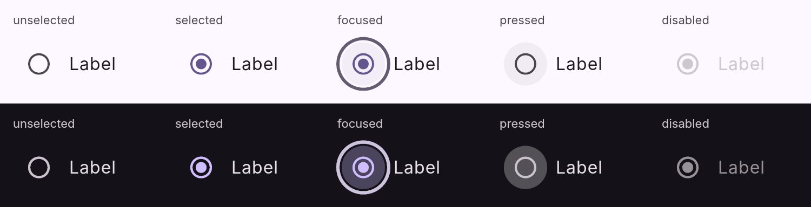

## 开关

52 × 32 dp 轨道；手柄关闭时 16 dp（带图标 24 dp）、打开时 24 dp、按下时 28 dp，以快速空间弹簧滑动并改变大小；可在手柄上显示图标；标签在开关之前。

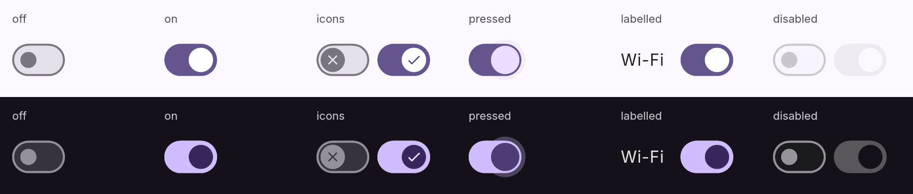

## 滑块

M3 Expressive 滑块：粗轨道被 4 dp 竖条手柄和两侧 6 dp 间隙分开，内侧角 2 dp，末端有 4 dp 停止点；离散滑块在每个步长显示停止点；拖动时手柄变窄，上方显示数值气泡。支持范围滑块（两个手柄，按下时取较近的一个）与居中滑块。

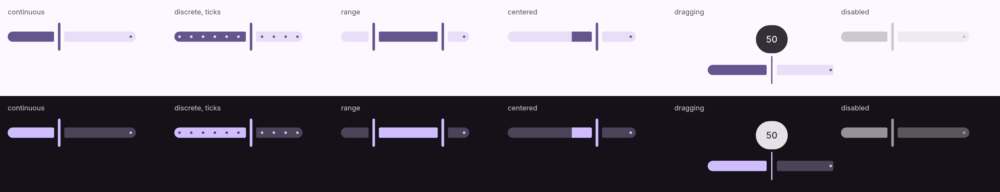

五种尺寸：轨道 16（默认）/24/40/56/96 dp。

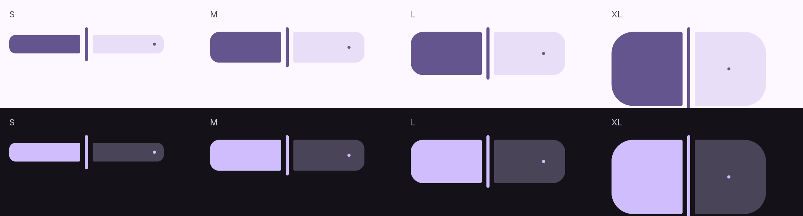

## 纸片

32 dp 高、8 dp 圆角，四种用途：assist（primary 色图标）、filter（选中时填充 secondary container 并出现对勾，宽度随之变化）、input（尾随移除图标，点击该图标或按 Delete/Backspace 移除）、suggestion；除 input 外都有 elevated 变体（surface container low 与阴影，替代轮廓）。

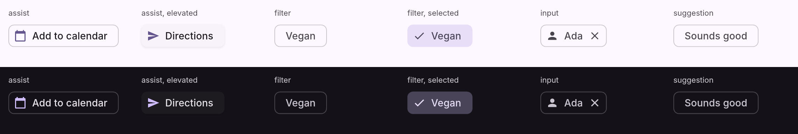

## 进度指示器

线性与圆形，确定与不确定，平直与波浪（M3 Expressive）。活动指示器 primary，与 secondary container 轨道间隔 4 dp，确定进度的轨道末端有停止点；数值以标准空间弹簧滑动。波浪在两端逐渐平复并持续行进；不确定线性为两段依次扫过的条，不确定圆形为一边旋转一边伸缩的弧。

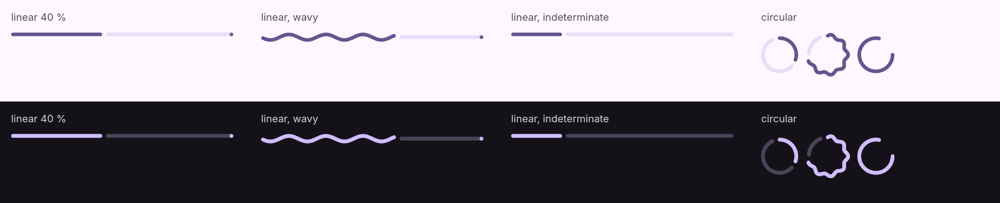

## 加载指示器

38 dp 形状在 Material 的七种形状（soft burst、9 边 cookie、五边形、pill、sunny、4 边 cookie、椭圆）之间每 0.65 s 以带回弹的曲线变形，同时旋转；contained 变体位于 48 dp primary container 圆上。减少动态效果时停在第一个形状。

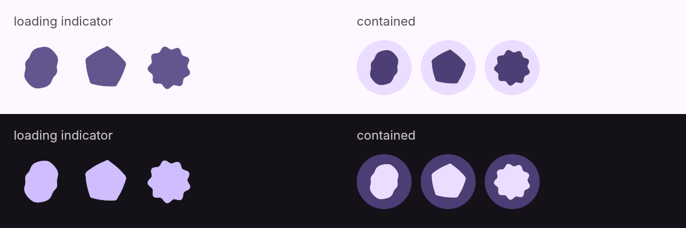

## 卡片

12 dp 圆角、16 dp 内边距的内容容器，三种样式：elevated（surface container low 与 1 级阴影）、filled（surface container highest）、outlined（surface 与 outline variant 描边）。可点击的卡片本身是按钮：状态层、涟漪、焦点环，悬停时阴影升高一级。

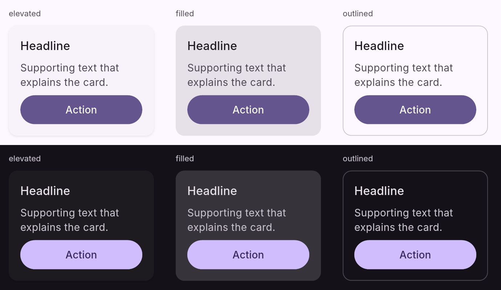

## 对话框

模态，28 dp 圆角的 surface container high 表面位于 32% scrim 之上，最小 280 dp、最大 560 dp 宽。可选图标（secondary 色，居中，标题随之居中）、headline small 标题、body medium 辅助文字与末尾对齐的文字按钮。打开时焦点移入第一个控件，Tab 在对话框内循环，Escape 或点击 scrim 关闭，关闭后焦点回到打开前的位置。进入时淡入并从 80% 放大，退出时淡出。还可切换为全屏对话框。

## 底部表与侧边表

模态底部表贴在窗口底边，顶部两角 28 dp 圆角，带拖动手柄，最宽 640 dp，从下方滑入；模态侧边表贴在窗口末端，全高 360 dp 宽，内侧两角 16 dp 圆角，带标题与关闭按钮，从侧边滑入。两者都在 scrim 之上，行为与对话框相同。标准（非模态）底部表与侧边表放在应用布局中，与主内容并列。

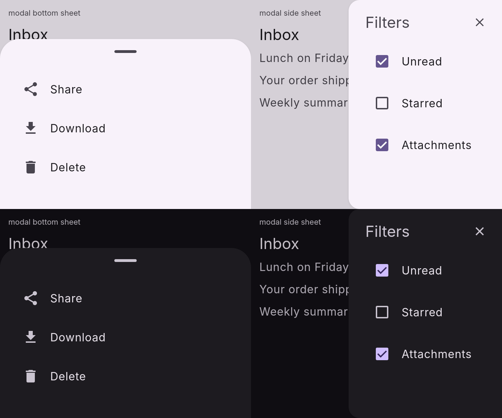

## 信息提示条（Snackbar）

窗口底部的 inverse surface 条，4 dp 圆角、3 级阴影，body medium 文字，可选 inverse primary 色的操作按钮与关闭按钮。不阻挡其他输入，按给定时长（短 4 s、长 10 s）自动关闭，操作或关闭按钮也会关闭它。

## 菜单

Aegle 菜单（键盘导航、子菜单、勾选与单选项、快捷键提示、定位）配上 Material 的外观：16 dp 圆角的 surface container 弹出层与 2 级阴影，44 dp 高的 body large 菜单项，状态层为 12 dp 圆角、内缩 6 dp。

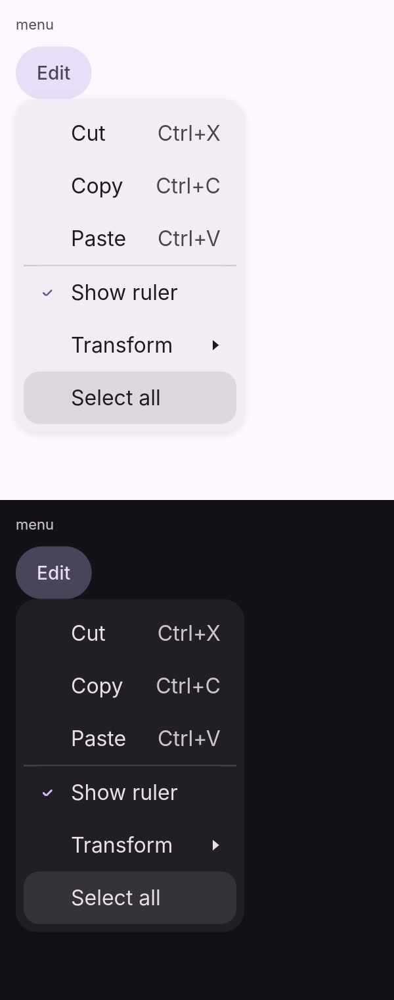

## 工具提示

普通工具提示沿用 Aegle 的提示（指针停留后出现，按下、Escape、离开时隐藏，并作为控件的无障碍描述），外观为 inverse surface、4 dp 圆角。富工具提示是锚点下方 12 dp 圆角的 surface container 表面，可带副标题、辅助文字与操作按钮，由应用显示和隐藏。

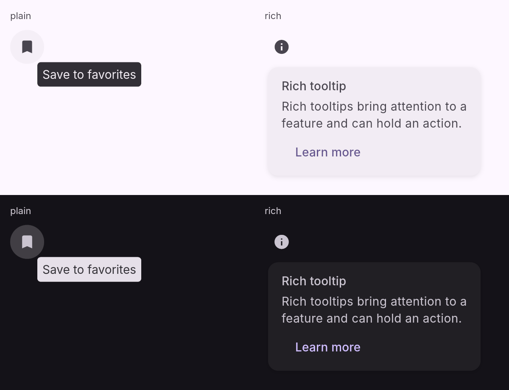

## 列表与分隔线

列表项是一行：可选的前导元素（图标、头像、复选框）、body large 标题与可选的 body medium 辅助文字、可选的尾随元素（开关、图标、label small 文字）。单行 56 dp，带辅助文字 72 dp。可点击的列表项有状态层与涟漪。分隔线为 1 dp outline variant，可横可竖，可从两端内缩。

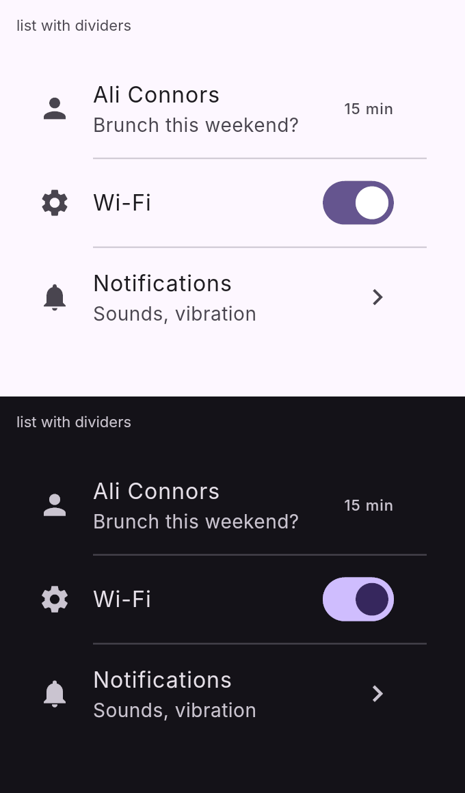

## 徽章

小徽章是 6 dp 的 error 色圆点；大徽章是 16 dp 高的胶囊，label small 数字，超过 999 显示 “999+”。徽章位于控件中央 24 dp 图标的右上角（从右到左时为左上角），作为控件的装饰绘制，不占用节点。

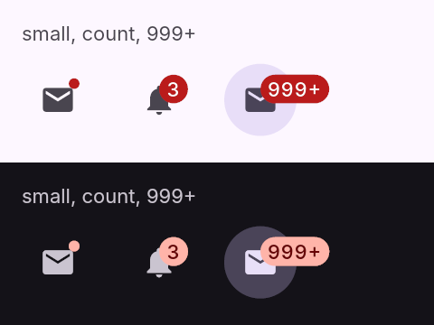

## 导航栏

紧凑窗口底部的 3–5 个目的地，surface container 上 64 dp 高（expressive）。选中项的图标位于 56 × 32 dp 的 secondary container 指示器中，指示器从中心展开；标签为 label medium，选中时 secondary 色。目的地可带徽章。

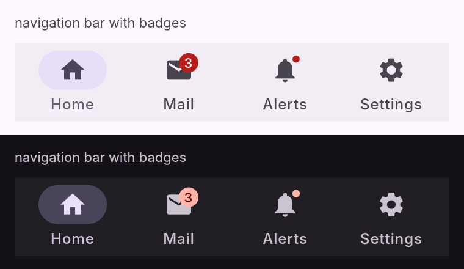

## 导航栏杆（Navigation rail）

中等及以上窗口起始边的目的地。收起时 96 dp 宽，标签位于指示器下方；展开时至少 220 dp 宽，目的地为 56 dp 高的行内胶囊（M3 Expressive 以展开的导航栏杆取代标准抽屉）。顶部可放菜单按钮与 FAB。

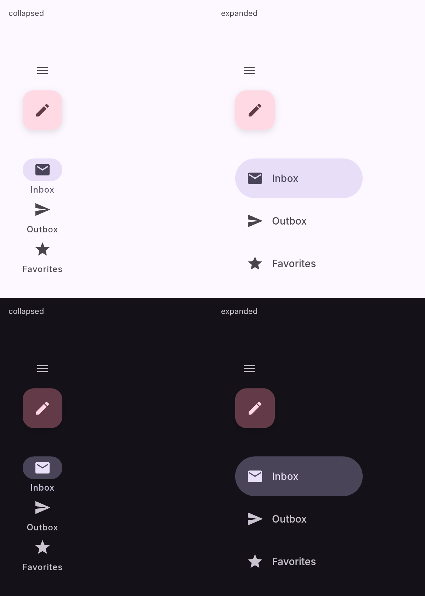

## 导航抽屉

360 dp 宽，目的地为 56 dp 高的全圆角胶囊，可分节（title small 节标题与内缩分隔线）。标准抽屉位于布局中；模态抽屉从起始边滑入，位于 scrim 之上，选择目的地后关闭。

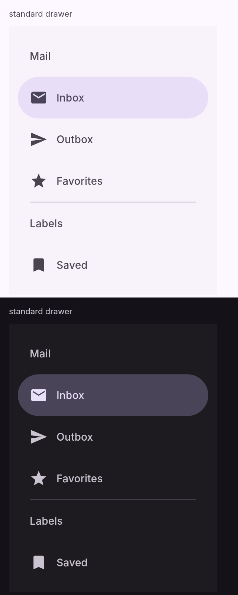

## 标签页

主标签页：title small 标签，可在上方带图标（64 dp 高，否则 48 dp），选中为 primary 色，3 dp 指示器只覆盖内容宽度、上方圆角；次级标签页：选中为 on surface 色，2 dp 指示器覆盖整个标签。固定标签页平分宽度；指示器以 expressive 空间弹簧滑到选中的标签，下方有 1 dp 分隔线。

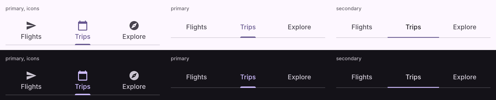

## 顶部应用栏

小型（64 dp，标题 title large）、居中、medium flexible（112 dp，标题单独一行 headline medium，可带副标题）、large flexible（120 dp，display small）。前导导航按钮与尾随操作均为标准图标按钮；内容滚动到栏下时 `set_scrolled(true)` 切换为 surface container。

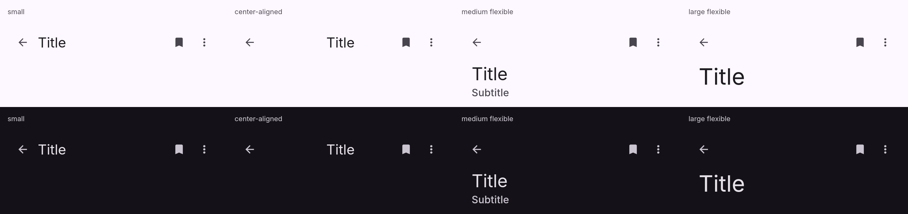

## 底部应用栏

80 dp 高的 surface container 栏，操作图标按钮与末端 FAB。

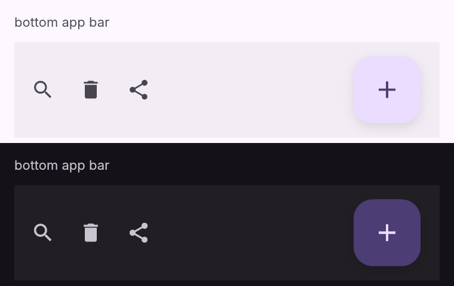

## 工具栏

M3 Expressive 工具栏：停靠工具栏贴底横跨窗口，64 dp 高，操作均匀分布；浮动工具栏是 64 dp 的胶囊，横向或纵向，3 级阴影。两者都有标准（surface container）与鲜明（primary container，内容 on primary container）两种配色。

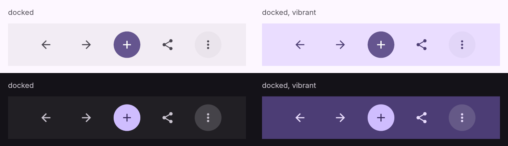

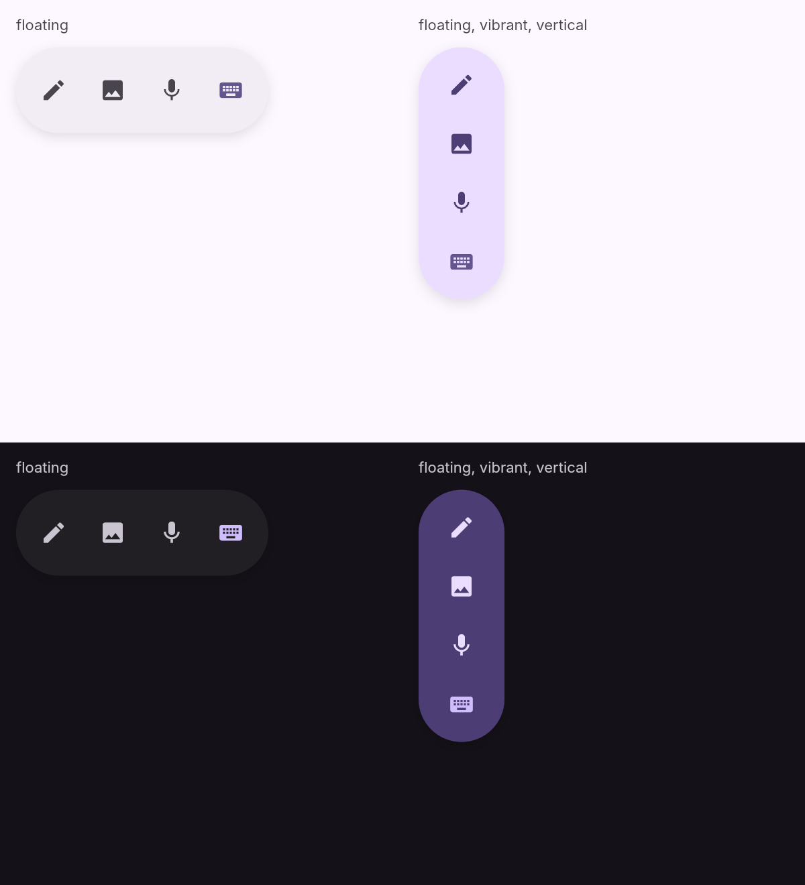

## 文本框

填充（surface container highest，上方圆角 4 dp，底部活动指示线）与描边（4 dp 圆角，浮动标签处描边留缺口）两种。56 dp 高，body large 文字；标签在输入或聚焦时以 0.75 倍缩放浮到上方，聚焦时为 primary 色、指示线 2 dp。可带前导/尾随图标（文字区随之内缩）、清除按钮、占位文字、辅助文字与字数计数（下方 20 dp）、错误状态（error 色）、密码与只读；多行文本框随内容增高。编辑、光标、选择、输入法与无障碍全部由 Aegle 的编辑器提供。

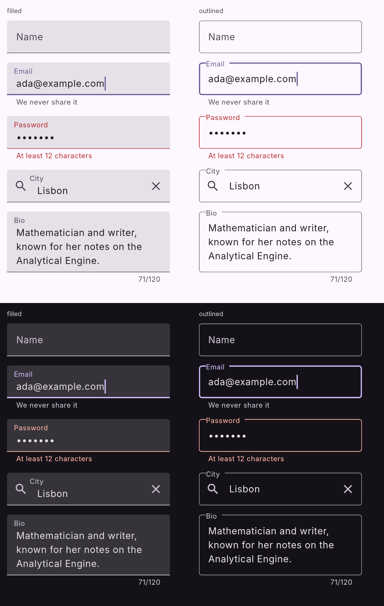

## 搜索

搜索栏是 56 dp 高的 surface container high 胶囊，前导搜索图标，可带尾随图标；输入文字时在栏下方打开停靠的搜索视图（28 dp 圆角），焦点留在栏中，清空后关闭。

## 日期选择器

停靠式（surface container high，16 dp 圆角，3 级阴影）与模态（对话框，标题 “Select date” 加 headline large 选中日期，取消/确定）。48 dp 网格，40 dp 圆形日期：选中为 primary 圆，今天为 primary 描边圆；范围选择时两端为 primary 圆，中间为 secondary container 带。前后月按钮，方向键移动光标（PageUp/PageDown 换月），Enter 或空格选择。

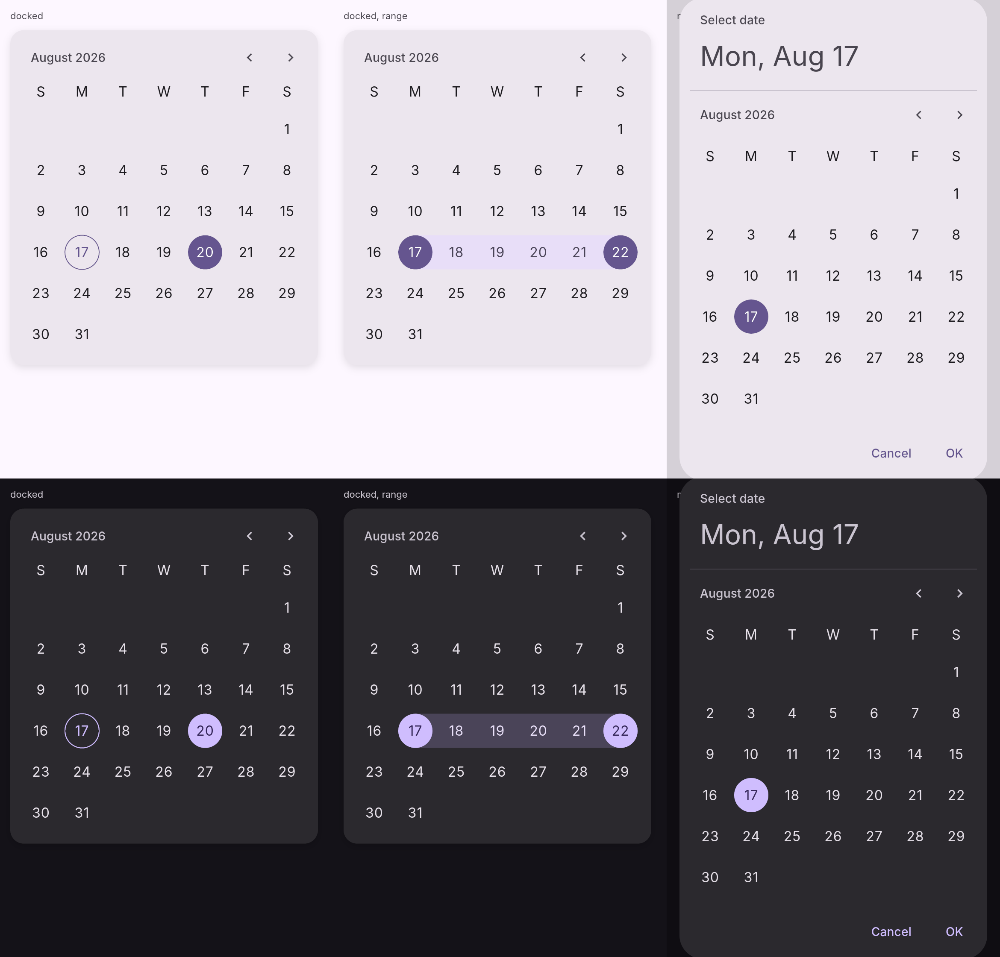

## 时间选择器

96 × 80 dp 的小时与分钟字段（display large），选中字段为 primary container；12 小时制带上下排列的 AM/PM 选择器（tertiary container）。256 dp 表盘：48 dp 选择器与指针，24 小时制外圈 00–11、内圈 12–23。点选或拖动表盘设置数值，选好小时后自动切换到分钟；方向键按 1 小时或 5 分钟步进。可嵌入布局，也可作为模态对话框。

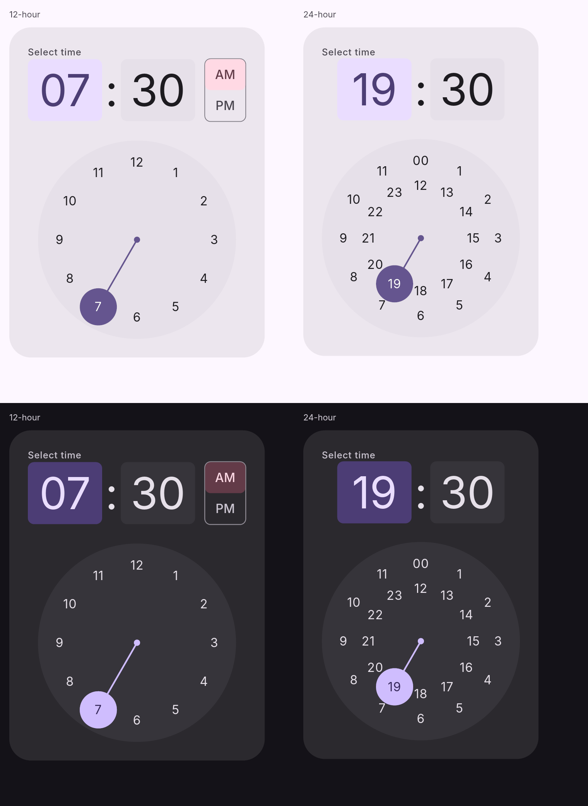

## 轮播

无约束（uncontained）布局：28 dp 圆角的等宽项目，间隔 8 dp，横向滚动越过边缘；竖向滚轮也横向滚动。项目裁剪内容（图片等），可点击。

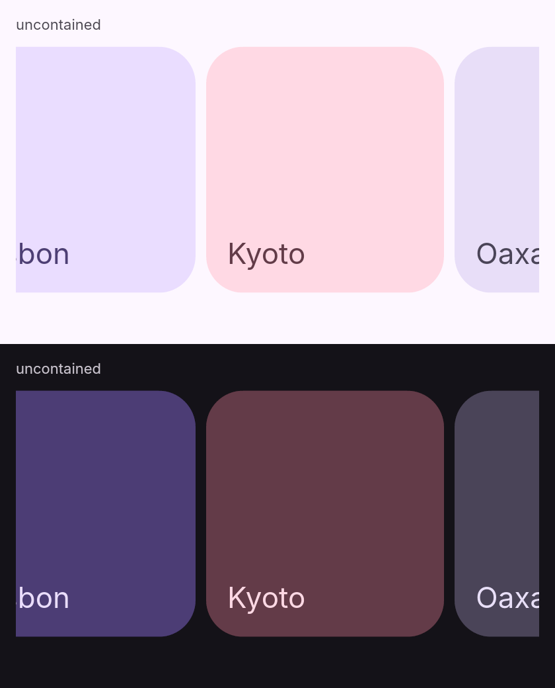

## 配色方案

同一界面在不同种子色与高对比模式下：上排浅色，下排深色。所有控件只从 `Scheme::of(theme)` 取色，切换主题或给子树设置局部主题即可整体换色。

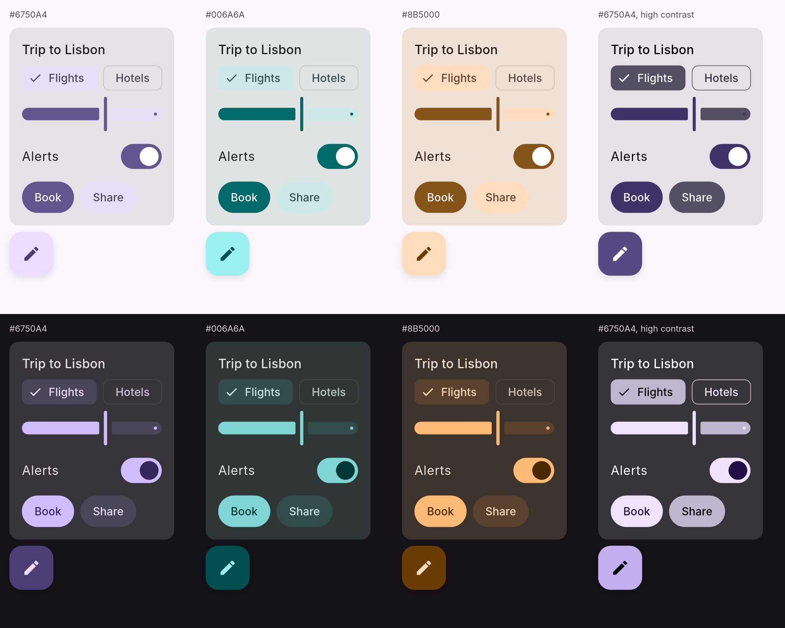
