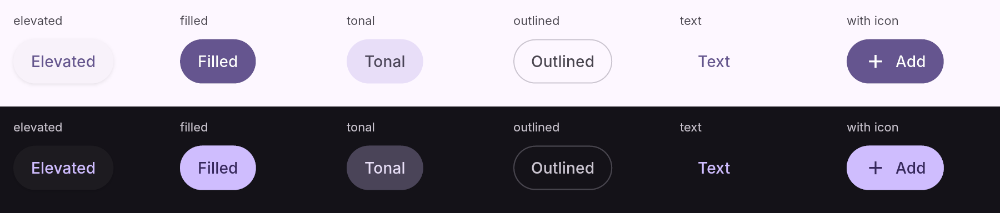
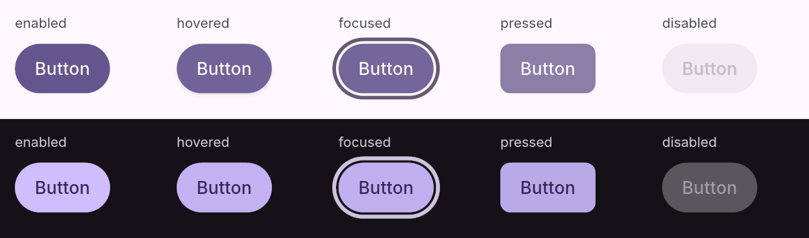
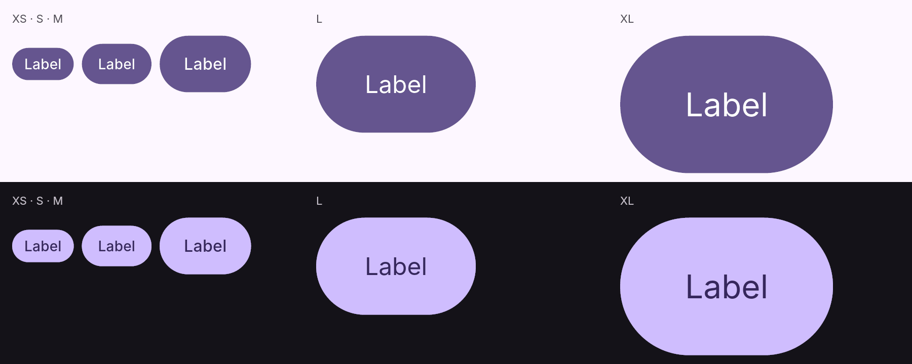
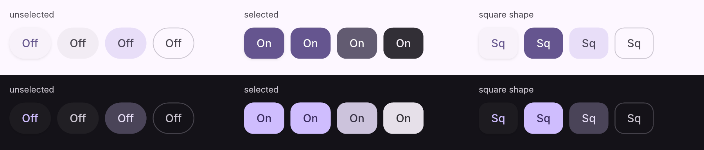
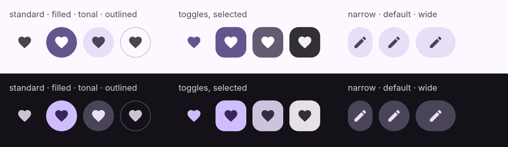
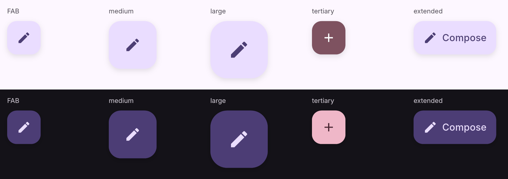
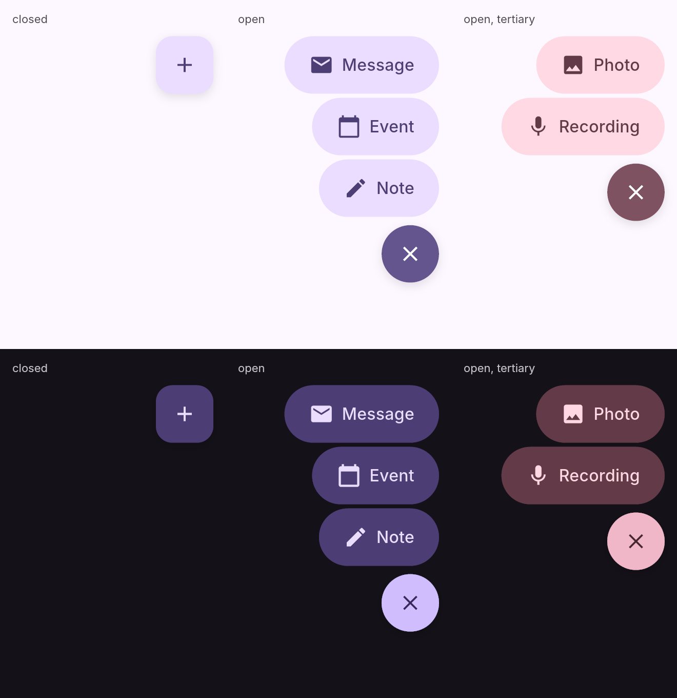
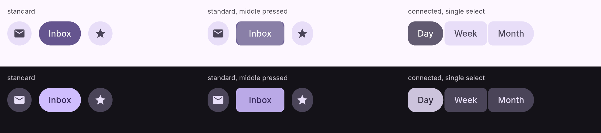
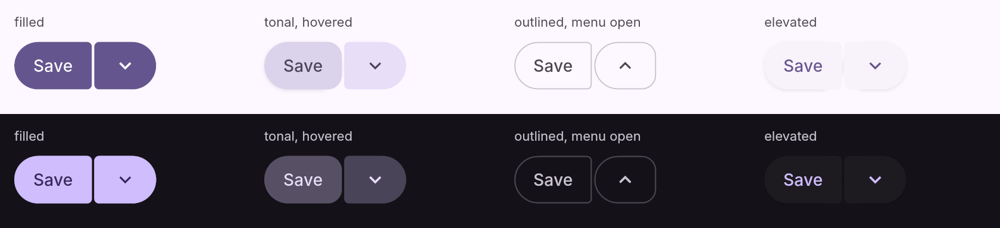
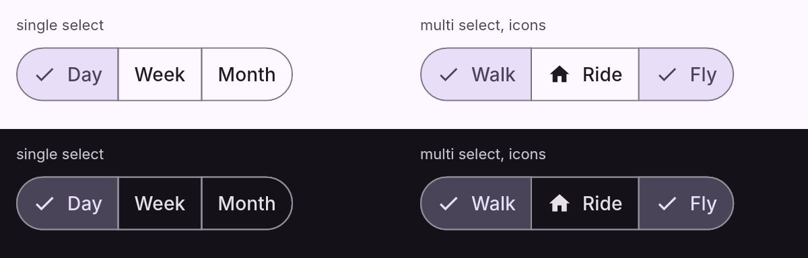

# 控件预览

全部截图由 `cargo run --example gallery` 用 Aegle 的软件渲染器无窗口生成，2 倍缩放，种子色为 Material 基准紫 `#6750A4`。每张图上行为浅色主题、下行为深色主题。颜色与弹簧动画稳定后截取；“按下”状态在涟漪展开后截取。

## 按钮

五种颜色样式：elevated、filled、tonal、outlined、text；可带前置图标。

状态：悬停与焦点是 8% / 10% 的状态层，按下是从按下点展开的涟漪，焦点环为 secondary 色 3 dp、外扩 2 dp，只在键盘焦点时显示；禁用为 onSurface 12% 容器与 38% 内容。

五种尺寸：XS 32、S 40（默认）、M 56、L 96、XL 136 dp，分别使用 label large、title medium、headline small、headline large 字体角色。

切换按钮：未选中为圆形，选中变为方形（square 形状则相反）；按下时角半径以 expressive 快速空间弹簧收缩到按下形状。

## 图标按钮

四种样式（standard、filled、tonal、outlined）、五种尺寸、三种宽度（narrow、default、wide），可作切换按钮。

## 悬浮操作按钮（FAB）

FAB 56、medium 80、large 96 dp，六种配色（三种 container 与三种强调色），elevation 3、悬停 4。扩展 FAB 在图标旁显示标签，`set_extended(false)` 收起为图标。

FAB 菜单：打开时 FAB 变为该配色组强调色的圆形关闭按钮，菜单项（56 dp 胶囊、对应 container 色）自下而上依次以快速空间弹簧升起并淡入；点选菜单项后关闭。

## 按钮组

标准按钮组按尺寸留出 18/12/8/8/8 dp 间距；按下某个按钮时它向两侧邻居伸展 15%，邻居相应让出，松开后以弹簧回弹（只改变绘制，不重新布局）。连接按钮组间距 2 dp，内侧角为 4/8/8/16/20 dp，按下时更方，选中时整体变圆；可设为单选（恰好一个选中）或多选。

## 分割按钮

动作按钮与菜单按钮相距 2 dp，内侧角 4/4/4/8/12 dp，悬停、焦点和按下时变圆（12 dp 等）；菜单打开时菜单部分变为圆形、箭头翻转。颜色不随打开改变，只加状态层。

## 分段按钮

经典 M3 分段按钮：40 dp 高、外侧全圆、内侧直角、相邻分段共用 1 dp 轮廓；选中分段填充 secondary container 并显示对勾。支持单选与多选。

